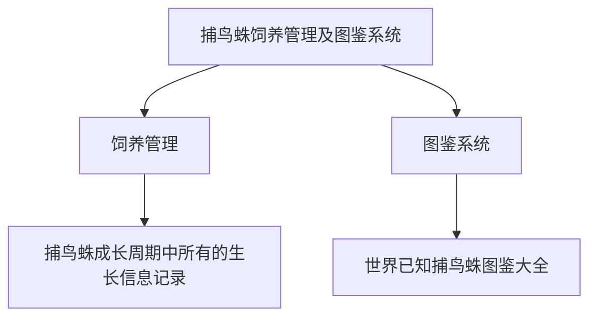

# 捕鸟蛛饲养管理及图鉴系统

## 1.背景

现在国内爬圈越来越壮大，蜘蛛圈的玩家都采用纸质记录蜘蛛生长的方式，不方便查阅也不方便修改、记录等操作。每只蜘蛛从出生到最后死亡，期间要经历很多次喂食、蜕皮，如果有可能还会有繁殖。需要记录的数据较多，而每一项数据都有可能影响蜘蛛的健康。另外，现在捕鸟蛛还处于被发现被定种的阶段，现在已知的捕鸟蛛有几百上千种，有这么多的种类却没有一个更新快，查阅方便的图鉴。所以这个项目分为了两部分，一部分是饲养管理，另一部分是做电子图鉴。

## 2.国内外现状

国内没有任何相关的系统，国外仅提供有图鉴系统，但更新缓慢。且近段时间国内已无法访问

## 3.业务需求

饲养者想要在饲养前了解某些捕鸟蛛（图鉴系统）。

饲养者想要在饲养捕鸟蛛时详细的记录信息，便于随时查看、记录以便于提高饲养质量。

饲养者想要在购买捕鸟蛛时能让卖家提供完整的生长记录，使得不论一只捕鸟蛛转手几次都能查看到从孵化到买到手的时候所有的成长记录

## 4.领域需求

### 4.1图鉴系统

1. 用户可以在图鉴系统中查阅到自己想查阅的捕鸟蛛的所有信息
2. 用户可以向图鉴系统提交增删改
3. 管理员可以直接对系统中的图鉴信息进行增删查改

### 4.2饲养记录系统

1. 用户可以按自己独有的分组习惯在系统中将自己的蜘蛛进行分组
2. 用户可以对自己饲养的蜘蛛及蜘蛛对应的信息进行增删查改
3. 用户可以把自己的蜘蛛及其对应信息转交给其他用户
4. 用户可以把自己在系统中记录的所有蜘蛛极其对应的信息以图表的形式导出

## 5.用户需求分析

### 5.1用户类型

**《捕鸟蛛饲养管理及图鉴系统》** 针对国内的个人用户，主要服务对象为老客户，具体为捕鸟蛛养殖用户。同时吸引新用户使用本系统。

### 5.2用户明确需求

新用户：用户进入首页，可以直观的浏览捕鸟蛛科的各个属的信息，包括图片信息和属名，以及每个属下面具有代表性的捕鸟蛛的种名或是俗名。
老用户：老用户有两种，一种是已注册用户，能使用本系统的大部分功能的用户。这类用户主要的需求是使用本系统对自己的捕鸟蛛的各种信息进行记录，包括喂养时间、蜕皮时间等。另一种用户的需求同新用户相似，主要使用本系统来了解各种捕鸟蛛的生活习性等信息。

### 5.3用户潜在需求

许多一般用户搜索相关捕鸟蛛信息时，在了解捕鸟蛛的样貌形态等信息后，可能会尝试养殖，这时就需要了解养殖信息。同时，如果有些用户发现捕鸟蛛的信息不对，需要纠正，这时就需要为用户提供反馈功能，用户可上传正确的信息，包括文本信息和图片信息。养殖用户不仅要记录蜘蛛的文本信息，也要能上传自己的蜘蛛的图片。同时也可能会想分享自己的养殖信息到其他社交平台。

## 6.系统需求分析

整个系统分为两大部分运行，一部分是图鉴系统，另一部分是饲养记录系统。两部分独立运行

### 6.1图鉴系统

1. 系统中存储的图鉴信息可能会有错误，所以需要在系统中有反馈的渠道
2. 必须要考虑到图鉴信息的专业性、准确性以及及时更新性

### 6.2饲养管理系统

1. 饲养管理系统要能适应所有用户对自己饲养的捕鸟蛛不同的分组方式
2. 用户的蜘蛛易主的时候需要把易主蜘蛛的信息转交到新主人手里

### 6.3权限管理

1. 注册后的用户可以上传图片，管理员可以选择更优质的图片作为封面
2. 注册后的用户可以向平台反馈捕鸟蛛信息有误
3. 因为要考虑到快速更新，所以需要有圈内比较专业的高级来进行数据的增删改操作。而普通用户只能查看。
4. 高级用户提交的增删改操作，会由管理员进行审核，审核后才会更新到图鉴数据库中。管理员拥有管理所有高级用户的权限。
5. 高级用户由管理员私下邀请

## 7.功能需求

### 7.1用户注册与登录

#### 7.1.1用户注册

用户可以通过邮箱、电话、QQ、微信的方式注册成为系统用户

#### 7.1.2用户登录

用户可以通过注册时的方式登录，登录后也可将多个方式绑定到一起

### 7.2图鉴系统

#### 7.2.1查阅图鉴

用户可以查阅图鉴中的捕鸟蛛图鉴信息

#### 7.2.2图鉴信息增删改

为了保证系统的准确性、专业性及更新及时性，需要对图鉴信息进行增删改

用户提交图鉴错误反馈后，由高级用户审核，审核通过的，上交管理员审核。

管理员审核后即可对图鉴信息增删改

用户还可以向图鉴系统上传对应捕鸟蛛的图片，管理员可以选择其中质量较高的作为对应品种的封面图片

### 7.3饲养记录系统

#### 7.3.1分组管理

对用户所饲养的捕鸟蛛进行分组管理

系统不需要关心用户对自己饲养的捕鸟蛛具体怎么分组，只需要知道用户分组后每个分组名即可。

#### 7.3.2蜘蛛管理

用户对记录的蜘蛛信息进行管理

#### 7.3.3蜘蛛信息统计

系统可以将用户的蜘蛛信息以图表的形式导出

## 权限需求

- 本系统主要服务有两大模块：一是方便捕鸟蛛爱好者查询不同蜘蛛品种，获取感兴趣的捕鸟蛛的生活基本信息，二是服务于捕鸟蛛的饲养者，帮助他们记录捕鸟蛛的饲养信息，方便以后进行查阅以及提高饲养的质量

- 系统中每个模块都有不同的权限，下面就对图鉴模块的权限作出详细的需求描述。

### 权限分级

- 一级权限：普通游客模式，不需要登录，进入网站之后即可获得游客权限

- 二级权限：普通用户模式，进入网站之后登录已有的用户账号即可获得用户权限

- 三级权限：高级用户模式，进入网站之后登录特殊的用户账号即可获得高级用户权限

- 四级权限：管理员模式，进入网站后登录管理员账号即可获得管理员权限

### 权限功能

- 一级权限：游客模式，只能对网站进行基本的浏览

- 二级权限：用户模式，可对网站进行基本的浏览，可对自己的账号和个人信息进行修改。可对捕鸟蛛图片和信息进行上传交由管理员审核

- 三级权限：高级用户，可对网站进行基本的浏览，可检查由用户提交的捕鸟蛛图片和信息，根据提交的信息对系统图鉴进行修改，删除，增加等操作，最后将修改后的信息交由管理员进行确认

- 四级权限：管理员模式，可对网站进行基本的浏览，可检查由高级用户提交的修改系统图鉴信息，并判断是否确认根据提交的信息对系统进行修改，可对高级用户进行管理。

### 图鉴模块管理

#### 图片管理

- 上传蜘蛛图片操作  --需要普通用户权限

- 查询蜘蛛图片操作  --需要普通游客权限

- 删除蜘蛛图片操作  --需要高级用户权限，并交由管理员确认

- 修改蜘蛛图片操作  --需要高级用户权限，并交由管理员确认

#### 信息管理

- 上传蜘蛛信息操作   --需要普通用户权限

- 查询蜘蛛信息操作   --需要普通游客权限

- 删除蜘蛛信息操作   --需要高级用户权限，并交由管理员确认

- 修改蜘蛛信息操作   --需要高级用户权限，并交由管理员确认
