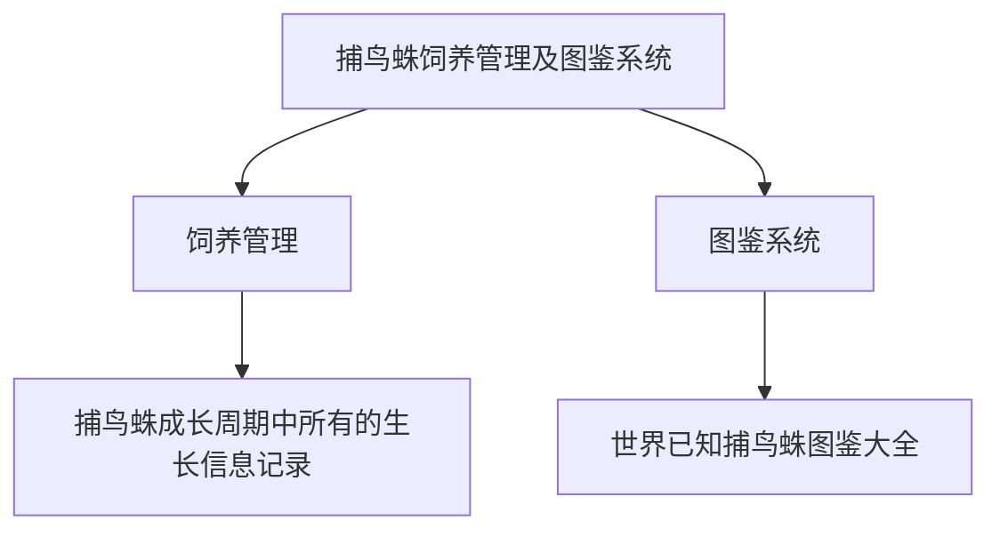

# 捕鸟蛛饲养管理及图鉴系统

## 1.背景

现在国内爬圈越来越壮大，蜘蛛圈的玩家都采用纸质记录蜘蛛生长的方式，不方便查阅也不方便修改、记录等操作。每只蜘蛛从出生到最后死亡，期间要经历很多次喂食、蜕皮，如果有可能还会有繁殖。需要记录的数据较多，而每一项数据都有可能影响蜘蛛的健康。另外，现在捕鸟蛛还处于被发现被定种的阶段，现在已知的捕鸟蛛有几百上千种，有这么多的种类却没有一个更新快，查阅方便的图鉴。所以这个项目分为了两部分，一部分是饲养管理，另一部分是做电子图鉴。

## 2.国内外现状

国内没有任何相关的系统，国外仅提供有图鉴系统，但更新缓慢。且近段时间国内已无法访问

## 3.业务需求

饲养者想要在饲养前了解某些捕鸟蛛（图鉴系统）。

饲养者想要在饲养捕鸟蛛时详细的记录信息，便于随时查看、记录以便于提高饲养质量。

饲养者想要在购买捕鸟蛛时能让卖家提供完整的生长记录，使得不论一只捕鸟蛛转手几次都能查看到从孵化到买到手的时候所有的成长记录

## 4.领域需求

### 4.1图鉴系统

1. 用户可以在图鉴系统中查阅到自己想查阅的捕鸟蛛的所有信息
2. 用户可以向图鉴系统提交增删改
3. 管理员可以直接对系统中的图鉴信息进行增删查改

### 4.2饲养记录系统

1. 用户可以按自己独有的分组习惯在系统中将自己的蜘蛛进行分组
2. 用户可以对自己饲养的蜘蛛及蜘蛛对应的信息进行增删查改
3. 用户可以把自己的蜘蛛及其对应信息转交给其他用户
4. 用户可以把自己在系统中记录的所有蜘蛛极其对应的信息以图表的形式导出

## 5.用户需求分析

### 5.1用户类型

**《捕鸟蛛饲养管理及图鉴系统》** 针对国内的个人用户，主要服务对象为老客户，具体为捕鸟蛛养殖用户。同时吸引新用户使用本系统。

### 5.2用户明确需求

新用户：用户进入首页，可以直观的浏览捕鸟蛛科的各个属的信息，包括图片信息和属名，以及每个属下面具有代表性的捕鸟蛛的种名或是俗名。
老用户：老用户有两种，一种是已注册用户，能使用本系统的大部分功能的用户。这类用户主要的需求是使用本系统对自己的捕鸟蛛的各种信息进行记录，包括喂养时间、蜕皮时间等。另一种用户的需求同新用户相似，主要使用本系统来了解各种捕鸟蛛的生活习性等信息。

### 5.3用户潜在需求

许多一般用户搜索相关捕鸟蛛信息时，在了解捕鸟蛛的样貌形态等信息后，可能会尝试养殖，这时就需要了解养殖信息。同时，如果有些用户发现捕鸟蛛的信息不对，需要纠正，这时就需要为用户提供反馈功能，用户可上传正确的信息，包括文本信息和图片信息。养殖用户不仅要记录蜘蛛的文本信息，也要能上传自己的蜘蛛的图片。同时也可能会想分享自己的养殖信息到其他社交平台。

## 6.系统需求分析

整个系统分为两大部分运行，一部分是图鉴系统，另一部分是饲养记录系统。两部分独立运行

### 6.1图鉴系统

1. 系统中存储的图鉴信息可能会有错误，所以需要在系统中有反馈的渠道
2. 必须要考虑到图鉴信息的专业性、准确性以及及时更新性

### 6.2饲养管理系统

1. 饲养管理系统要能适应所有用户对自己饲养的捕鸟蛛不同的分组方式
2. 用户的蜘蛛易主的时候需要把易主蜘蛛的信息转交到新主人手里

### 6.3权限管理

1. 注册后的用户可以上传图片，管理员可以选择更优质的图片作为封面
2. 注册后的用户可以向平台反馈捕鸟蛛信息有误
3. 因为要考虑到快速更新，所以需要有圈内比较专业的高级来进行数据的增删改操作。而普通用户只能查看。
4. 高级用户提交的增删改操作，会由管理员进行审核，审核后才会更新到图鉴数据库中。管理员拥有管理所有高级用户的权限。
5. 高级用户由管理员私下邀请

## 7.功能需求

### 7.1用户注册与登录

#### 7.1.1用户注册

用户可以通过邮箱、电话、QQ、微信的方式注册成为系统用户

#### 7.1.2用户登录

用户可以通过注册时的方式登录，登录后也可将多个方式绑定到一起

### 7.2图鉴系统

#### 7.2.1查阅图鉴

用户可以查阅图鉴中的捕鸟蛛图鉴信息

#### 7.2.2图鉴信息增删改

为了保证系统的准确性、专业性及更新及时性，需要对图鉴信息进行增删改

用户提交图鉴错误反馈后，由高级用户审核，审核通过的，上交管理员审核。

管理员审核后即可对图鉴信息增删改

用户还可以向图鉴系统上传对应捕鸟蛛的图片，管理员可以选择其中质量较高的作为对应品种的封面图片

### 7.3饲养记录系统

#### 7.3.1分组管理

对用户所饲养的捕鸟蛛进行分组管理

系统不需要关心用户对自己饲养的捕鸟蛛具体怎么分组，只需要知道用户分组后每个分组名即可。

#### 7.3.2蜘蛛管理

用户对记录的蜘蛛信息进行管理

#### 7.3.3蜘蛛信息统计

系统可以将用户的蜘蛛信息以图表的形式导出

## 权限需求

- 本系统主要服务有两大模块：一是方便捕鸟蛛爱好者查询不同蜘蛛品种，获取感兴趣的捕鸟蛛的生活基本信息，二是服务于捕鸟蛛的饲养者，帮助他们记录捕鸟蛛的饲养信息，方便以后进行查阅以及提高饲养的质量

- 系统中每个模块都有不同的权限，下面就对图鉴模块的权限作出详细的需求描述。

### 权限分级

- 一级权限：普通游客模式，不需要登录，进入网站之后即可获得游客权限

- 二级权限：普通用户模式，进入网站之后登录已有的用户账号即可获得用户权限

- 三级权限：高级用户模式，进入网站之后登录特殊的用户账号即可获得高级用户权限

- 四级权限：管理员模式，进入网站后登录管理员账号即可获得管理员权限

### 权限功能

- 一级权限：游客模式，只能对网站进行基本的浏览

- 二级权限：用户模式，可对网站进行基本的浏览，可对自己的账号和个人信息进行修改。可对捕鸟蛛图片和信息进行上传交由管理员审核

- 三级权限：高级用户，可对网站进行基本的浏览，可检查由用户提交的捕鸟蛛图片和信息，根据提交的信息对系统图鉴进行修改，删除，增加等操作，最后将修改后的信息交由管理员进行确认

- 四级权限：管理员模式，可对网站进行基本的浏览，可检查由高级用户提交的修改系统图鉴信息，并判断是否确认根据提交的信息对系统进行修改，可对高级用户进行管理。

### 图鉴模块管理

#### 图片管理

- 上传蜘蛛图片操作  --需要普通用户权限

- 查询蜘蛛图片操作  --需要普通游客权限

- 删除蜘蛛图片操作  --需要高级用户权限，并交由管理员确认

- 修改蜘蛛图片操作  --需要高级用户权限，并交由管理员确认

#### 信息管理

- 上传蜘蛛信息操作   --需要普通用户权限

- 查询蜘蛛信息操作   --需要普通游客权限

- 删除蜘蛛信息操作   --需要高级用户权限，并交由管理员确认

- 修改蜘蛛信息操作   --需要高级用户权限，并交由管理员确认

## 非功能性需求

### 性能需求

用户对于性能的要求是无止境的，但是过度重视性能，导致成本过高，显然是不合理的。作为产品经理，应该对业务所需支持的性能有所了解，与技术人员共同协商，制定符合实际使用的产品性能指标。

#### 响应时间

如页面间跳转时间≤3秒，精确搜索反馈结果≤1秒。有时，在当下情况，性能已经到达瓶颈。我们作为产品设计者，也可以从产品体验这一块做出优化，比如某个页面数据量大，导致加载时间长，我们给用户提供加载进度条，预计加载时间，减少用户焦虑。还有日常使用的分页加载，像刷微博一样，每次加载部分数据，当用户进行操作时，再逐渐加载。

要求相应时间最多不超过10s。

本项目中，编写前端时，在大部分地方采用了页面局部刷新，减少数据的浪费，可以大大的提高页面的刷新效率。

在编写访问数据库流程时，我们会采用优化后的MySql代码进行编写数据库，以便提高访问效率，以提高系统的响应时间。

#### 吞吐量

单位时间内成功地传送数据的数量。
就本项目的业务范围而言，因为这是一次课程团队作业，范围相对正式项目而言较小，故而对于吞吐量的大小并没有太大的要求，但是本项目也能支持上百用户的并发。

#### 容量

系统所能存储的数据量。
本系统初步能存储1000位用户的信息和所有捕蛛鸟的信息。

#### 可靠性

系统出错时能维持基本的信息浏览。
本项目在开发完成后因软件缺点而导致的故障频率低，即BUG少。
数据库进行备份以防止系统故障而出现数据丢失。
软件符合法定的相关标准、协定、规则。

### 安全性

随着互联网的发展，安全性越来越重要。
现在，大多用户的数据都存在于各个企业中，所以对于数据的安全性，重视程度也越来越高。

#### 保密性

数据加密保护，保证数据在采集、传输和处理过程中不被偷窥、窃取、篡改。业务数据需要在存储时进行加密，确保不可破解。
对于用户的各种信息，都会进行加密，例如用户密码，会使用md5加密，以保障用户信息不会被除用户以外的人知道。
数据库存储密码，业务敏感信息加密。
日志内容不包含密码和业务敏感数据。
敏感业务接口报文加密。

#### 权限控制

根据用户权限控制访问数据，进行操作记录等等。
系统中的用户会分为管理员和普通用户，管理员能够决定用户是否能在系统中上传信息。当然所有的用户都能在系统中浏览系统中存储的所有蜘蛛信息。
防止重复提交。

#### 防攻击

IP限制、高频访问限制等等，如：用户高频点击，有时不是恶意，但也有可能造成系统异常。我们在进行产品设计时，是否需要控制点击频率，或者点击后是否将按钮修改为不可点击状态。这些也是需要我们考虑的地方。
在本系统中注册新账户时，我们会提供给用户一个验证码，以防恶意注册引起大量账户浪费和数据库浪费。本系统还会监视同一IP在一定时间段的注册频率，若频率过高，系统会封锁该IP，使得用户再一段时间内无法再继续注册。
程序防范脚本注入。

### 扩展性分析

要理解扩展性，首先要知道好的扩展性带来的好处，要知道从软件工程的角度来说，软件开发至少需要经历开发、测试、运维等阶段，一个刚开发出来的软件往往需要经历多次的测试、线上bug修复之后才能进入一个相对比较稳定的状态，也正因此一些常用的软件刚发布时会称为beta版本，也意味着新添加的功能或者特性没有经过实际环境考验，不是非常稳定。说了这么多，是想说明扩展性带来的好处：少改代码、甚至不改代码不仅仅是降低程序员的工作量，也意味着稳定，而稳定的程序才能带来价值和好的用户体验。这也是为什么越是实际经验多的人越重视扩展性，因为没有经验的开发者往往会天真地以为初期设计地不好只需后期多花点时间开发，而意识不到差的扩展性对其他流程和软件稳定性的损害。

#### 功能模块化

对项目流畅做出了一定且准确的抽象归纳，总结了项目中核心功能不变的流程，例如浏览、上传、修改蜘蛛信息等。将这些功能单独模块化解耦后，那么在以后增加某个功能的时候，就不用去修改其他模块，只需要修改流程就好。而如果将新增加的功能所在的流程做出足够的归纳抽象，抽象出一个新的接口，新增加的功能只需要实现这个接口就可以无缝的接入原来的流程，这样就大大的减少了需要增加的代码。

#### 兼容变化

需求永远是变化的如果变动是不可预测的，那就必须要新增代码来解决，而如果变动是在可预测的范围内，往往可以通过配置化的方式去解决，就好比大家都熟知的Spring，Spring解决的是Bean的管理和依赖，他不可能知道你需要用什么bean，但是他知道你的bean都是java对象，所以只要确定的bean的class类型就可以实例化这个bean，你就可以用起来了，其他的依赖注入、init-method、pre处理器、post处理器等等都是在此基础上的高级特性。而这些对于所有bean来说都是一致的，所以只需要你通过配置文件告诉他你要用哪些bean就够了。而spring也正是因为对bean不“挑食”，不像EJB一样要求实现这个接口、那个接口才成为了如今最受欢迎的容器，这也进一步证实了“少写代码”有多重要。当然了，配置文件本质上也可以说是代码，所以这种方式和上一种方式其实只是更进了一步而已，并没有本质的不同。

### 稳定性需求

#### 无外部人员干扰

本项目是学生团队的团队作业项目，没有具体客户的存在。而在实际的项目开发过程中，开发团队往往受到客户的直接约束，有着固定的工期，并且就需求来说，并不是很稳定，在很多时候，客户只能指定一个大概的需求范围，并且客户有可能综合多家厂家的功能，要求开发商实现，还有一些项目客户只提出研究方向，根本没有具体的需求细节，使得开发团队无法得到准确的需求。

#### 产品的更新

本项目是学生团队的团队作业项目，所以需求更加稳定，工期也比较宽松，比较容易把控，但产品的需求是连续的，产品需要不停的升级增加新功能才有生命力。由于需求的稳定性不同，往往需要比较好的开发模型来支持，否则很容易发生到了项目后期才发现实现的功能与实际应用需求不符，达不到使用效果。但是由于本项目是学生团队作业项目，所以对于产品的更新换代并不频发，项目的稳定性也足够强。

## 合法性

本项目遵守相关法律，无侵权行为。
